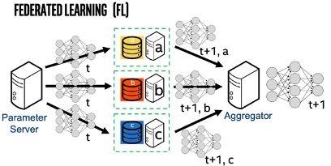

.. # Copyright (C) 2020 Intel Corporation
.. # Licensed under the Apache License, Version 2.0 (the "License");
.. # you may not use this file except in compliance with the License.
.. # You may obtain a copy of the License at
.. #
.. #     http://www.apache.org/licenses/LICENSE-2.0
.. #
.. # Unless required by applicable law or agreed to in writing, software
.. # distributed under the License is distributed on an "AS IS" BASIS,
.. # WITHOUT WARRANTIES OR CONDITIONS OF ANY KIND, either express or implied.
.. # See the License for the specific language governing permissions and
.. # limitations under the License.

***************************
What is Federated Learning?
***************************

`Federated learning <https://en.wikipedia.org/wiki/Federated_learning>`_ is a distributed machine learning approach that
enables organizations to collaborate on machine learning projects
without sharing sensitive data, such as, patient records, financial data,
or classified secrets (`McMahan, 2016 <https://arxiv.org/abs/1602.05629>`_;
`Sheller, Bakas et al., 2020 <https://www.nature.com/articles/s41598-020-69250-1>`_;
`Yang, Liu, Chen, & Tong, 2019 <https://arxiv.org/abs/1902.04885>`_).
The basic premise behind federated learning
is that the model moves to meet the data rather than the data moving
to meet the model. Therefore, the minimum data movement needed
across the federation is solely the model parameters and their updates.

   Federated Learning
